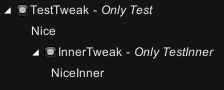

# Tweaks

## 예시
Main.cs
```cs
public class Main
{
    public static void Load(UnityModManager.ModEntry modEntry)
    {
        //Setup All Tweaks in Current Mod Assembly.
        Runner.Run(modEntry);
    }
}
```

TestTweaks.cs
```cs
[Tweak("TestTweak", "Only Test", PatchesType = typeof(TTPatches), SettingsType = typeof(TTSettings), Priority = 0)]
public class TestTweak : Tweak
{
    [SyncSettings] //Sync TweakSettings
    public static TTSettings Settings { get; set; }
    [SyncTweak] //Sync Tweak
    public static TestTweak TT { get; set; }
    public override void OnEnable()
    {
        Log("Nice");
    }
    public override void OnDisable()
    {
        Log("Nice");
    }
    public override void OnGUI()
    {
        SGL.L("Nice");
    }
    public override void OnHideGUI()
    {
        Log("Nice");
    }
    public override void OnUpdate()
    {
        //TODO
    }
    [Tweak("InnerTweak", "Only TestInner", Priority = 0)]
    public class InnerTweak : TestTweak
    {
        public override void OnEnable()
        {
            Log("NiceInner");
        }
        public override void OnGUI()
        {
            SGL.L("NiceInner");
        }
    }
}
public static class TTPatches
{
    //Patches
}
public class TTSettings : TweakSettings
{
    //Settings
}
```
## 결과

## BASED ON
https://github.com/PizzaLovers007/AdofaiTweaks/blob/master/AdofaiTweaks/Core/Tweak.cs
https://github.com/PizzaLovers007/AdofaiTweaks/blob/master/AdofaiTweaks/Core/TweakRunner.cs
https://github.com/PizzaLovers007/AdofaiTweaks/blob/master/AdofaiTweaks/Core/TweakSettings.cs
https://github.com/PizzaLovers007/AdofaiTweaks/blob/master/AdofaiTweaks/Core/SettingsSynchronizer.cs
https://github.com/PizzaLovers007/AdofaiTweaks/blob/master/AdofaiTweaks/Core/Attributes/RegisterTweakAttribute.cs
https://github.com/PizzaLovers007/AdofaiTweaks/blob/master/AdofaiTweaks/Core/Attributes/SyncTweakSettingsAttribute.cs
